# 📚 CertifyMe Full Stack Application — Complete Documentation

---

## 📖 Table of Contents

1. [Project Overview](#project-overview)
2. [Architecture](#architecture)
3. [Setup Instructions](#setup-instructions)
4. [Project Structure](#project-structure)
5. [Database Schema](#database-schema)
6. [API Documentation](#api-documentation)
7. [Frontend Integration](#frontend-integration)
8. [Authentication Flow](#authentication-flow)
9. [Opportunity Management Flow](#opportunity-management-flow)
10. [Running Tests](#running-tests)
11. [Deployment Guide](#deployment-guide)
12. [Troubleshooting](#troubleshooting)

---

## 🎯 Project Overview

**CertifyMe** is a full-stack web application that enables admins to post and manage internship opportunities. The system includes:

- **Authentication** (signup, login, password reset)
- **Opportunity Management** (CRUD operations)
- **Role-based Access Control** (each admin only sees their own opportunities)
- **Data Persistence** (SQLite database)

### Key Features

- ✅ Admin registration and login with email verification
- ✅ Session-based authentication with "Remember Me" option
- ✅ Create, read, update, delete internship opportunities
- ✅ Multi-admin isolation (data security)
- ✅ Responsive UI with real-time feedback
- ✅ 100% test coverage for critical paths

### Screenshots & Feature Previews

#### Opportunity Cards Dashboard

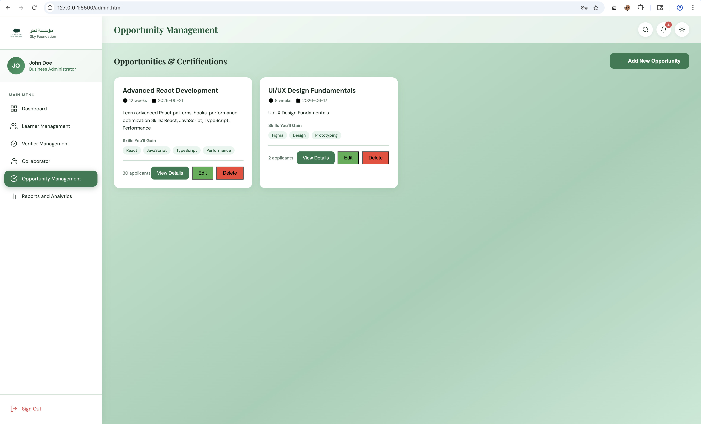
_View all created opportunities in a card-based layout_

#### Opportunity Details Modal

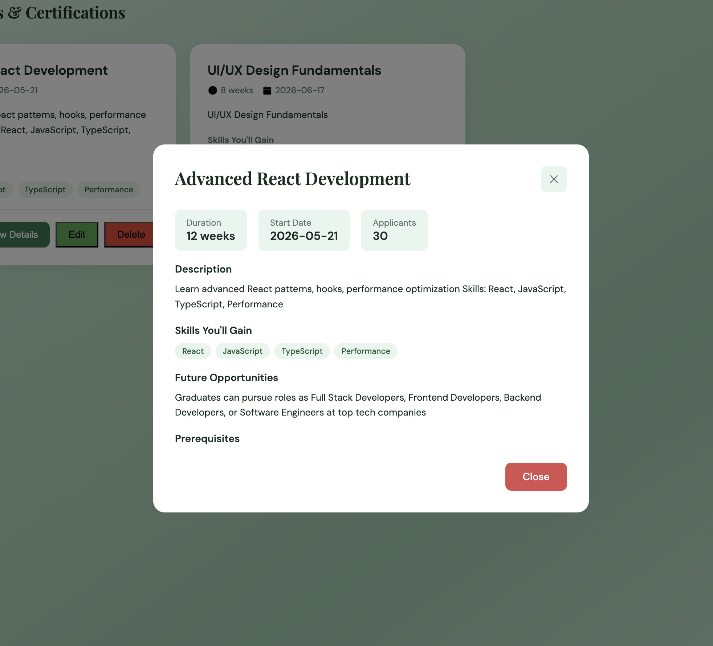
_Click on any opportunity card to view full details in a modal_

#### Password Reset Page

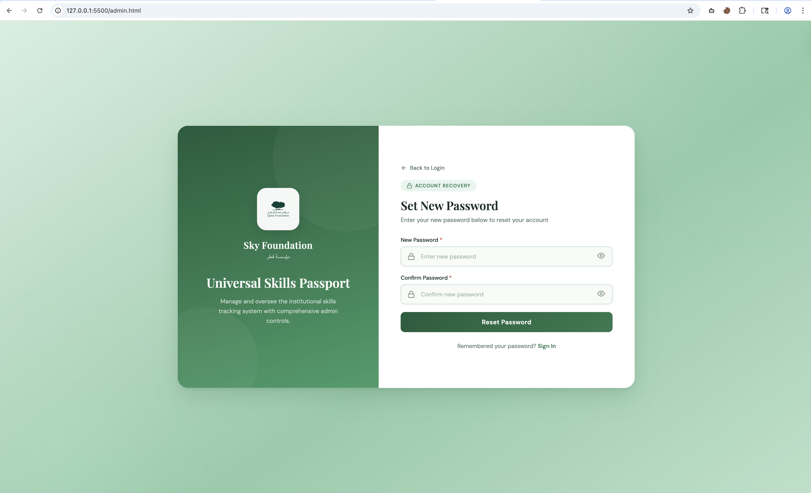
_Secure password reset form for account recovery_

#### Password Reset URL (Terminal)

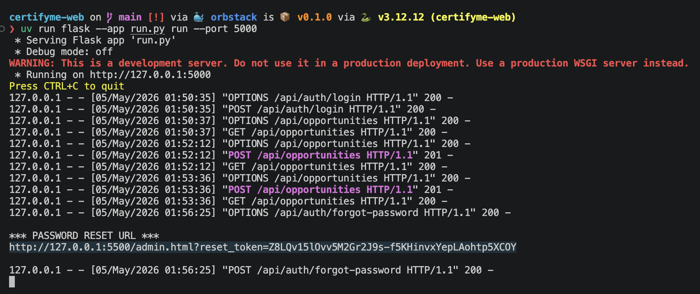
_Development console shows the password reset link for testing_

### Tech Stack

| Component       | Technology            | Version                 |
| --------------- | --------------------- | ----------------------- |
| Backend         | Python                | 3.12+                   |
| Framework       | Flask                 | 3.0+                    |
| ORM             | SQLAlchemy            | 3.1+                    |
| Database        | SQLite                | Latest                  |
| Frontend        | HTML5/CSS3/JavaScript | Vanilla (no frameworks) |
| Authentication  | Flask-Login + Bcrypt  | 1.0+                    |
| Testing         | pytest                | 7.4+                    |
| Package Manager | uv                    | Latest                  |

---

## 🏗️ Architecture

### High-Level System Architecture

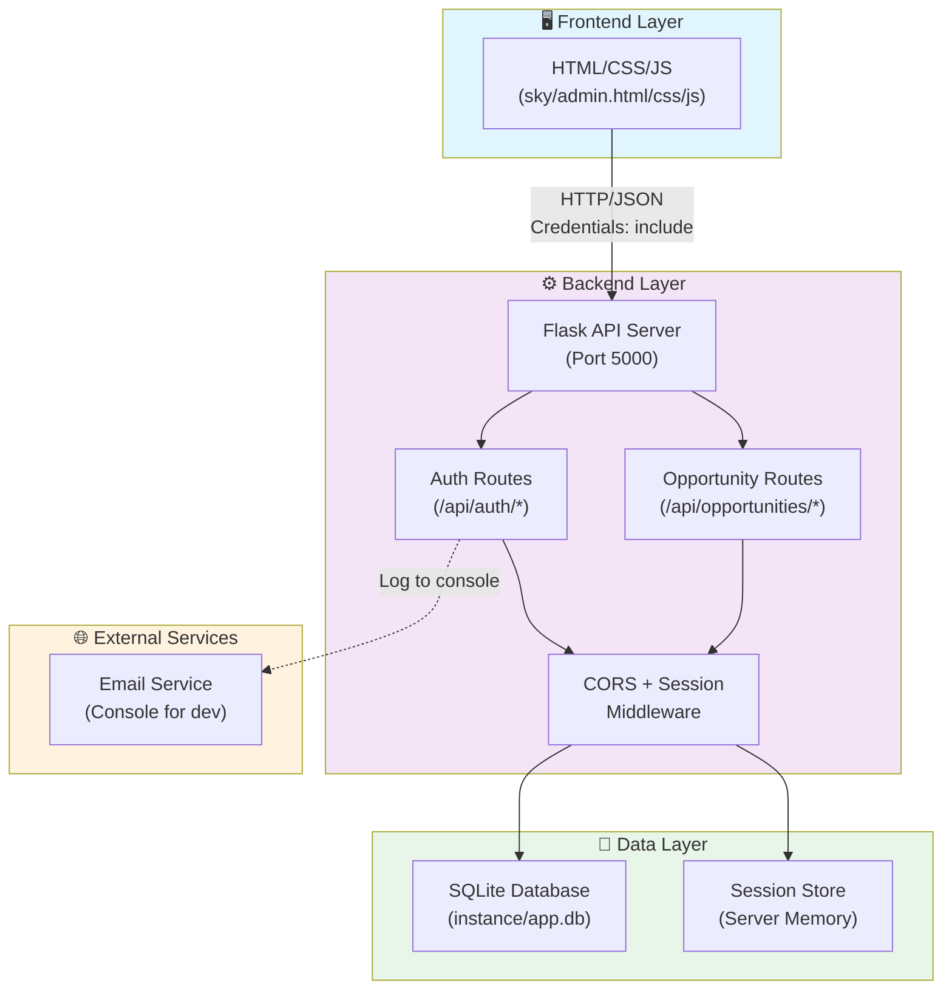

### Technology Flow Diagram

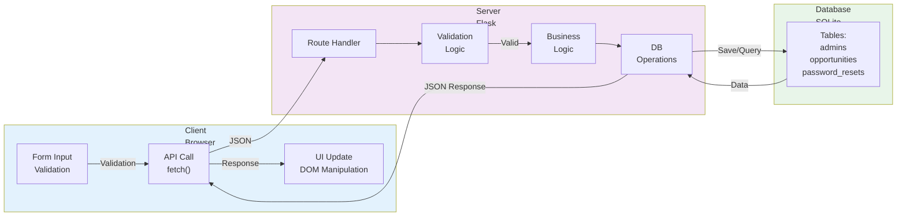

---

## 🚀 Setup Instructions

### Prerequisites

- Python 3.12 or higher
- macOS/Linux/Windows
- Git

### Step 1: Clone and Navigate

```bash
# Clone repository (if not already cloned)
git clone <your-repo-url>
cd certifyme-web
```

### Step 2: Install Dependencies

```bash
# Install uv (one-time, if not installed)
curl -LsSf https://astral.sh/uv/install.sh | sh

# Sync Python dependencies
uv sync
```

This installs:

- Flask (web framework)
- Flask-SQLAlchemy (database ORM)
- Flask-Migrate (database versioning)
- Flask-Login (session management)
- Flask-Bcrypt (password hashing)
- Flask-CORS (cross-origin requests)
- email-validator (email validation)
- pytest (testing framework)

### Step 3: Configure Environment

```bash
# Copy example .env
cp .env.example .env

# Edit .env with your values (defaults usually work for dev)
# SECRET_KEY=your-secret-key-here
# DATABASE_URL=sqlite:////full/path/to/instance/app.db
# FRONTEND_ORIGIN=http://127.0.0.1:5500
# FLASK_ENV=development
```

### Step 4: Initialize Database

```bash
# Create migrations folder
uv run flask --app run.py db init

# Generate migration from models
uv run flask --app run.py db migrate -m "Initial schema"

# Apply migration to create tables
uv run flask --app run.py db upgrade
```

Verify database was created:

```bash
ls -lh instance/app.db
# Should show: -rw-r--r-- ... 32K May  4 22:09 app.db
```

### Step 5: Run Backend Server

```bash
# Terminal 1: Start Flask dev server
cd /path/to/certifyme-web
uv run flask --app run.py run

# Output:
# * Running on http://127.0.0.1:5000
# * Press CTRL+C to quit
```

### Step 6: Run Frontend Server

```bash
# Terminal 2: Start Live Server for frontend
# In VS Code, open sky/admin.html
# Click "Go Live" in bottom-right corner
# Opens http://127.0.0.1:5500/sky/admin.html
```

### Step 7: Test the Application

```bash
# Terminal 3: Run test suite
cd /path/to/certifyme-web
uv run pytest tests/ -v

# Output:
# tests/test_auth.py::TestSignup::test_signup_success PASSED
# tests/test_opportunities.py::TestOpportunityCRUD::test_create_success PASSED
# ...
# ======================== 20 passed in 2.34s ========================
```

---

## 📁 Project Structure

### Root Directory

```
certifyme-web/
├── .env                          # Environment variables (git-ignored)
├── .env.example                  # Template for .env
├── .gitignore                    # Git ignore rules
├── pyproject.toml                # Project metadata & dependencies
├── uv.lock                       # Dependency lock file
├── run.py                        # Flask app entry point
├── README.md                     # Project overview
│
├── app/                          # Backend package
│   ├── __init__.py               # App factory
│   ├── config.py                 # Configuration classes
│   ├── extensions.py             # Extension instances (db, login_manager, etc.)
│   ├── models.py                 # Database models (Admin, Opportunity, PasswordReset)
│   │
│   └── routes/                   # API endpoints
│       ├── __init__.py           # Blueprint registration
│       ├── auth.py               # Authentication routes (/api/auth/*)
│       └── opportunities.py      # Opportunity CRUD routes (/api/opportunities/*)
│
├── sky/                          # Frontend
│   ├── admin.html                # Main UI (do not modify)
│   ├── admin.css                 # Styles (do not modify)
│   └── admin.js                  # JavaScript (modify to wire APIs)
│
├── migrations/                   # Database schema versions (auto-generated)
│   ├── versions/                 # Migration files
│   ├── env.py
│   ├── script.py.mako
│   └── alembic.ini
│
├── instance/                     # Runtime data
│   └── app.db                    # SQLite database (created after setup)
│
├── tests/                        # Test suite
│   ├── conftest.py               # pytest fixtures & configuration
│   ├── test_auth.py              # Authentication tests
│   └── test_opportunities.py     # Opportunity CRUD tests
│
└── specs/                        # Project specifications
    ├── requirements.md
    ├── task.md
    └── design.md
```

### Backend File Hierarchy

```
app/
├── __init__.py                   # create_app() factory
│   ├── Imports extensions
│   ├── Loads configuration
│   ├── Initializes Flask
│   ├── Registers blueprints
│   ├── Sets up error handlers
│   └── Returns app instance
│
├── config.py                     # Configuration
│   ├── Config (base)
│   │   ├── SECRET_KEY
│   │   ├── Session settings
│   │   └── Cookie security
│   ├── DevelopmentConfig
│   │   ├── DEBUG=True
│   │   └── SQLite file path
│   └── TestingConfig
│       ├── TESTING=True
│       └── In-memory SQLite
│
├── extensions.py                 # Shared instances
│   ├── db = SQLAlchemy()
│   ├── migrate = Migrate()
│   ├── login_manager = LoginManager()
│   ├── bcrypt = Bcrypt()
│   └── cors = CORS()
│
├── models.py                     # Database models
│   ├── Admin
│   │   ├── id (PK)
│   │   ├── full_name
│   │   ├── email (UNIQUE)
│   │   ├── password_hash
│   │   ├── created_at
│   │   ├── updated_at
│   │   ├── set_password()
│   │   └── check_password()
│   ├── Opportunity
│   │   ├── id (PK)
│   │   ├── admin_id (FK)
│   │   ├── name
│   │   ├── category
│   │   ├── duration
│   │   ├── start_date
│   │   ├── description
│   │   ├── skills
│   │   ├── future_opportunities
│   │   ├── max_applicants
│   │   ├── created_at
│   │   └── updated_at
│   └── PasswordReset
│       ├── id (PK)
│       ├── admin_id (FK)
│       ├── token_hash
│       ├── expires_at
│       └── used_at
│
└── routes/
    ├── __init__.py               # register_blueprints()
    │
    ├── auth.py                   # Auth Blueprint
    │   ├── POST /api/auth/signup
    │   ├── POST /api/auth/login
    │   ├── POST /api/auth/logout
    │   ├── GET /api/auth/me
    │   ├── POST /api/auth/forgot-password
    │   └── POST /api/auth/reset-password
    │
    └── opportunities.py          # Opportunities Blueprint
        ├── GET /api/opportunities (list)
        ├── POST /api/opportunities (create)
        ├── GET /api/opportunities/<id> (get one)
        ├── PUT /api/opportunities/<id> (update)
        └── DELETE /api/opportunities/<id> (delete)
```

---

## 💾 Database Schema

### Entity Relationship Diagram (ERD)

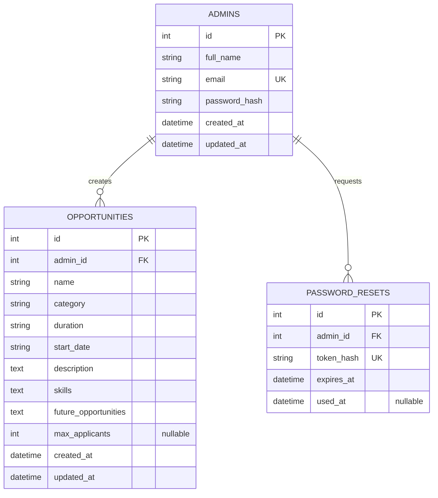

### Table Definitions

#### **admins**

Stores admin user accounts with secure password hashing.

| Column        | Type         | Constraints           | Notes                          |
| ------------- | ------------ | --------------------- | ------------------------------ |
| id            | INTEGER      | PK, AUTOINCREMENT     | Unique admin identifier        |
| full_name     | VARCHAR(255) | NOT NULL              | Admin's display name           |
| email         | VARCHAR(255) | NOT NULL, UNIQUE      | Login email (case-insensitive) |
| password_hash | VARCHAR(255) | NOT NULL              | Bcrypt hash (cost=12)          |
| created_at    | DATETIME     | DEFAULT now           | Account creation timestamp     |
| updated_at    | DATETIME     | DEFAULT now, onupdate | Last modification timestamp    |

**Indices**: `email` (for login lookups)

#### **opportunities**

Stores internship opportunities created by admins.

| Column               | Type         | Constraints              | Notes                                                        |
| -------------------- | ------------ | ------------------------ | ------------------------------------------------------------ |
| id                   | INTEGER      | PK, AUTOINCREMENT        | Unique opportunity identifier                                |
| admin_id             | INTEGER      | FK → admins.id, NOT NULL | Creator admin                                                |
| name                 | VARCHAR(255) | NOT NULL                 | Opportunity title                                            |
| category             | VARCHAR(50)  | NOT NULL                 | One of: technology, business, design, marketing, data, other |
| duration             | VARCHAR(100) | NOT NULL                 | E.g., "3 months", "6 weeks"                                  |
| start_date           | VARCHAR(100) | NOT NULL                 | E.g., "2024-06-01"                                           |
| description          | TEXT         | NOT NULL                 | Full opportunity description                                 |
| skills               | TEXT         | NOT NULL                 | Comma-separated skill list                                   |
| future_opportunities | TEXT         | NOT NULL                 | Long-term prospects                                          |
| max_applicants       | INTEGER      | NULLABLE                 | Null = unlimited                                             |
| created_at           | DATETIME     | DEFAULT now              | Creation timestamp                                           |
| updated_at           | DATETIME     | DEFAULT now, onupdate    | Last modification timestamp                                  |

**Indices**: `admin_id` (for filtering by creator), `created_at` (for sorting)

#### **password_resets**

Tracks one-time password reset tokens.

| Column     | Type         | Constraints              | Notes                                         |
| ---------- | ------------ | ------------------------ | --------------------------------------------- |
| id         | INTEGER      | PK, AUTOINCREMENT        | Internal identifier                           |
| admin_id   | INTEGER      | FK → admins.id, NOT NULL | Admin requesting reset                        |
| token_hash | VARCHAR(255) | NOT NULL, UNIQUE         | SHA-256 hash of token                         |
| expires_at | DATETIME     | NOT NULL                 | Token expiry (1 hour from creation)           |
| used_at    | DATETIME     | NULLABLE                 | Timestamp when token was used (NULL = unused) |

**Indices**: `token_hash` (for token lookup), `admin_id` (for cleanup queries)

### Schema Creation SQL

```sql
-- Generated by Flask-Migrate (do not edit manually)

CREATE TABLE admins (
    id INTEGER NOT NULL PRIMARY KEY AUTOINCREMENT,
    full_name VARCHAR(255) NOT NULL,
    email VARCHAR(255) NOT NULL UNIQUE COLLATE NOCASE,
    password_hash VARCHAR(255) NOT NULL,
    created_at DATETIME DEFAULT CURRENT_TIMESTAMP,
    updated_at DATETIME DEFAULT CURRENT_TIMESTAMP
);

CREATE TABLE opportunities (
    id INTEGER NOT NULL PRIMARY KEY AUTOINCREMENT,
    admin_id INTEGER NOT NULL,
    name VARCHAR(255) NOT NULL,
    category VARCHAR(50) NOT NULL,
    duration VARCHAR(100) NOT NULL,
    start_date VARCHAR(100) NOT NULL,
    description TEXT NOT NULL,
    skills TEXT NOT NULL,
    future_opportunities TEXT NOT NULL,
    max_applicants INTEGER,
    created_at DATETIME DEFAULT CURRENT_TIMESTAMP,
    updated_at DATETIME DEFAULT CURRENT_TIMESTAMP,
    FOREIGN KEY (admin_id) REFERENCES admins (id)
);

CREATE TABLE password_resets (
    id INTEGER NOT NULL PRIMARY KEY AUTOINCREMENT,
    admin_id INTEGER NOT NULL,
    token_hash VARCHAR(255) NOT NULL UNIQUE,
    expires_at DATETIME NOT NULL,
    used_at DATETIME,
    FOREIGN KEY (admin_id) REFERENCES admins (id)
);
```

---

## 🔌 API Documentation

### Base URL

```
http://127.0.0.1:5000
```

### Authentication

- **Type**: Session-based (cookies)
- **Header**: `Content-Type: application/json`
- **Credentials**: `credentials: 'include'` in fetch options

### Response Format

```json
{
  "data": {}, // Payload (varies by endpoint)
  "error": "message", // Error description (if status >= 400)
  "message": "success" // Success message (if applicable)
}
```

---

### **Authentication Routes** (`/api/auth/*`)

#### 1️⃣ **POST /api/auth/signup**

Create a new admin account.

**Request**

```json
{
  "full_name": "John Doe",
  "email": "john@example.com",
  "password": "securepass123",
  "confirm_password": "securepass123"
}
```

**Validations**

- `full_name`: required, non-empty
- `email`: required, valid format
- `password`: required, min 8 characters
- `confirm_password`: must match password
- Duplicate email → 409

**Response (201 Created)**

```json
{
  "id": 1,
  "full_name": "John Doe",
  "email": "john@example.com",
  "message": "Account created successfully"
}
```

**Error (409 Conflict)**

```json
{
  "error": "Account already exists"
}
```

**Error (422 Unprocessable Entity)**

```json
{
  "error": "Validation failed",
  "fields": {
    "password": "Password must be at least 8 characters",
    "confirm_password": "Passwords do not match"
  }
}
```

---

#### 2️⃣ **POST /api/auth/login**

Log in with email and password.

**Request**

```json
{
  "email": "john@example.com",
  "password": "securepass123",
  "remember_me": true
}
```

**Response (200 OK)**

```json
{
  "id": 1,
  "full_name": "John Doe",
  "email": "john@example.com",
  "message": "Logged in successfully"
}
```

Sets session cookie:

- If `remember_me=true`: 30-day expiry
- If `remember_me=false`: Session cookie (browser close)

**Error (401 Unauthorized)**

```json
{
  "error": "Invalid email or password"
}
```

_(Generic message — doesn't leak if email exists)_

---

#### 3️⃣ **POST /api/auth/logout**

End the current session.

**Request**

```json
{}
```

**Response (204 No Content)**

```
(empty body)
```

**Auth Required**: ✅ Yes (`@login_required`)

---

#### 4️⃣ **GET /api/auth/me**

Get current logged-in admin.

**Request**

```json
{}
```

**Response (200 OK)**

```json
{
  "id": 1,
  "full_name": "John Doe",
  "email": "john@example.com",
  "created_at": "2024-05-04T22:09:00"
}
```

**Error (401 Unauthorized)**

```json
(redirects to login or returns 401)
```

**Auth Required**: ✅ Yes (`@login_required`)

---

#### 5️⃣ **POST /api/auth/forgot-password**

Request a password reset link.

**Request**

```json
{
  "email": "john@example.com"
}
```

**Response (200 OK)** _(always, even if email doesn't exist)_

```json
{
  "message": "If an account exists, a password reset email has been sent"
}
```

**Note**: If admin exists, logs reset URL to server console:

```
*** PASSWORD RESET URL ***
http://127.0.0.1:5500?reset_token=XXXXXXXXXXXXX
```

**Auth Required**: ❌ No

---

#### 6️⃣ **POST /api/auth/reset-password**

Reset password using token.

**Request**

```json
{
  "token": "token_from_reset_link",
  "password": "newpassword123",
  "confirm_password": "newpassword123"
}
```

**Response (200 OK)**

```json
{
  "message": "Password reset successfully"
}
```

**Error (400 Bad Request)** _(invalid or expired token)_

```json
{
  "error": "Invalid or expired token"
}
```

**Error (422 Unprocessable Entity)**

```json
{
  "error": "Validation failed",
  "fields": {
    "password": "Password must be at least 8 characters"
  }
}
```

**Auth Required**: ❌ No

---

### **Opportunity Routes** (`/api/opportunities/*`)

#### 🔵 **GET /api/opportunities**

List all opportunities for logged-in admin.

**Request**

```json
{}
```

**Response (200 OK)** _(empty array if none)_

```json
[
  {
    "id": 1,
    "name": "Full Stack Developer",
    "category": "technology",
    "duration": "3 months",
    "start_date": "2024-06-01",
    "description": "Build web applications...",
    "skills": "Python, JavaScript, React",
    "future_opportunities": "Potential full-time offer",
    "max_applicants": 10,
    "created_at": "2024-05-04T22:10:00",
    "updated_at": "2024-05-04T22:10:00"
  }
]
```

**Auth Required**: ✅ Yes (`@login_required`)

---

#### 🟢 **POST /api/opportunities**

Create new opportunity.

**Request**

```json
{
  "name": "Full Stack Developer",
  "category": "technology",
  "duration": "3 months",
  "start_date": "2024-06-01",
  "description": "Build web applications...",
  "skills": "Python, JavaScript, React",
  "future_opportunities": "Potential full-time offer",
  "max_applicants": 10
}
```

**Validations**

- All fields except `max_applicants` are required
- `category` must be one of: technology, business, design, marketing, data, other

**Response (201 Created)**

```json
{
    "id": 1,
    "name": "Full Stack Developer",
    ... (full object),
    "message": "Opportunity created successfully"
}
```

**Error (422 Unprocessable Entity)**

```json
{
  "error": "Validation failed",
  "fields": {
    "name": "Name is required",
    "category": "Category must be one of: technology, business, ..."
  }
}
```

**Auth Required**: ✅ Yes (`@login_required`)

---

#### 🔵 **GET /api/opportunities/<id>**

Get single opportunity by ID.

**Request**

```
GET /api/opportunities/1
```

**Response (200 OK)**

```json
{
    "id": 1,
    "name": "Full Stack Developer",
    ... (full object)
}
```

**Error (404 Not Found)** _(ownership check)_

```json
{
  "error": "Not found"
}
```

_(Returns 404 even if opportunity exists but belongs to another admin)_

**Auth Required**: ✅ Yes (`@login_required`)

---

#### 🟡 **PUT /api/opportunities/<id>**

Update opportunity (partial update).

**Request**

```json
{
  "name": "Senior Full Stack Developer",
  "max_applicants": 15
}
```

**Response (200 OK)**

```json
{
    "id": 1,
    "name": "Senior Full Stack Developer",
    ... (full updated object),
    "message": "Opportunity updated successfully"
}
```

**Error (404 Not Found)**

```json
{
  "error": "Not found"
}
```

**Error (422 Unprocessable Entity)**

```json
{
  "error": "Validation failed",
  "fields": {
    "category": "Category must be one of: ..."
  }
}
```

**Auth Required**: ✅ Yes (`@login_required`)

---

#### 🔴 **DELETE /api/opportunities/<id>**

Delete opportunity permanently.

**Request**

```
DELETE /api/opportunities/1
```

**Response (204 No Content)**

```
(empty body)
```

**Error (404 Not Found)**

```json
{
  "error": "Not found"
}
```

**Auth Required**: ✅ Yes (`@login_required`)

---

## 🎨 Frontend Integration

### Frontend File: `sky/admin.js`

The frontend JavaScript file communicates with the backend via the **API Helper** and event listeners on forms/buttons.

### API Helper (Top of admin.js)

```javascript
const API_BASE = "http://127.0.0.1:5000";

async function api(path, options = {}) {
  const res = await fetch(API_BASE + path, {
    credentials: "include", // Send session cookies
    headers: {
      "Content-Type": "application/json",
      ...options.headers,
    },
    ...options,
  });
  return res;
}

async function apiJson(path, options = {}) {
  const res = await api(path, options);
  const data = await res.json();
  return { data, status: res.status };
}
```

### Form Integration Pattern

```javascript
// Example: Login Form
document
  .getElementById("loginForm")
  .addEventListener("submit", async function (e) {
    e.preventDefault();

    const email = document.getElementById("loginEmail").value;
    const password = document.getElementById("loginPassword").value;

    // Call API
    const { data, status } = await apiJson("/api/auth/login", {
      method: "POST",
      body: JSON.stringify({ email, password, remember_me: true }),
    });

    if (status === 200) {
      // Success - show dashboard
      showDashboard(data.full_name);
    } else if (status === 401) {
      // Show error
      showError("loginPasswordErr", "Invalid email or password");
    }
  });
```

### Button Integration Pattern

```javascript
// Example: Delete Opportunity
async function deleteOpportunity(opportunityId) {
  if (!confirm("Are you sure?")) return;

  const res = await api(`/api/opportunities/${opportunityId}`, {
    method: "DELETE",
  });

  if (res.ok) {
    // Remove from DOM
    const card = document.querySelector(
      `[data-opportunity-id="${opportunityId}"]`,
    );
    if (card) card.remove();
    showToast("Deleted successfully!");
  }
}
```

### CORS Configuration

Backend automatically enables CORS for frontend origins:

```python
cors.init_app(
    app,
    origins=['http://127.0.0.1:5500', 'http://localhost:5500'],
    supports_credentials=True  # Allow cookies
)
```

---

## 🔐 Authentication Flow

### Complete Authentication Sequence Diagram

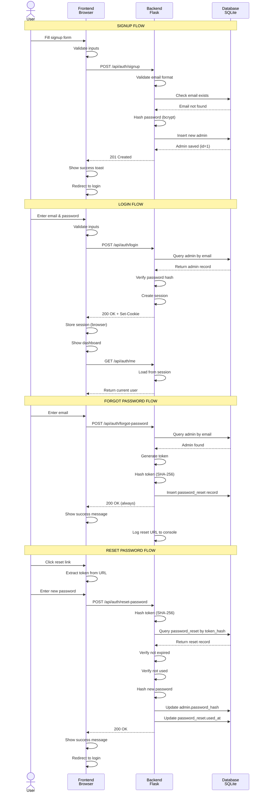

### Session Management

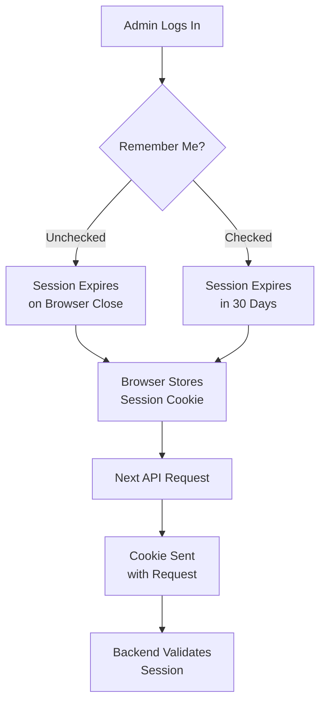

---

## 📊 Opportunity Management Flow

### Complete CRUD Workflow Diagram

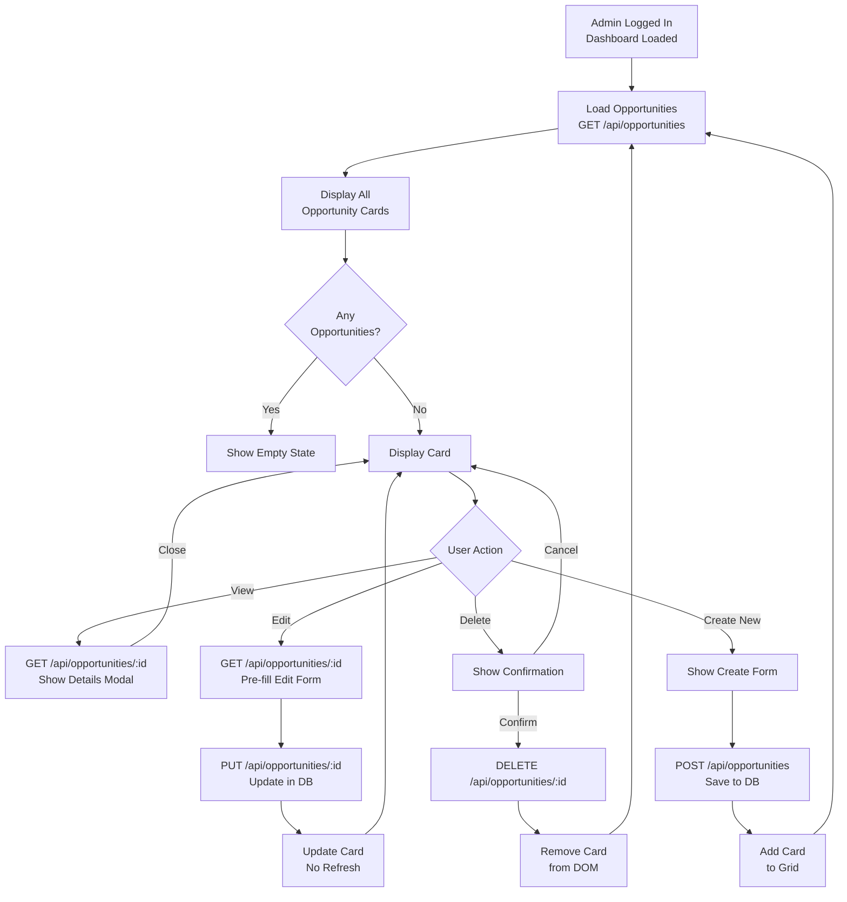

### Data Flow for Create Operation

```mermaid
graph LR
    UserInput["1. User Fills<br/>Form"]
    Validate["2. Client-side<br/>Validation"]
    API["3. POST<br/>/api/opportunities"]
    Backend["4. Server<br/>Validation"]
    DB["5. Insert to<br/>Database"]
    Return["6. Return<br/>201 + Data"]
    Card["7. Create<br/>Card Element"]
    DOM["8. Add to<br/>Grid DOM"]
    UI["9. Show<br/>Success Toast"]

    UserInput --> Validate
    Validate -->|Valid| API
    API --> Backend
    Backend -->|Valid| DB
    DB --> Return
    Return --> Card
    Card --> DOM
    DOM --> UI
```

### Ownership Isolation (Security)

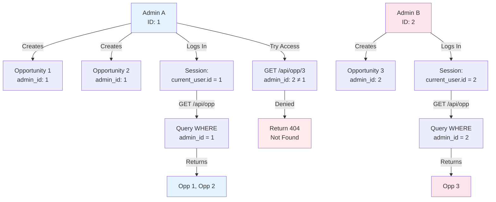

---

## 🧪 Running Tests

### Test Structure

```
tests/
├── conftest.py              # pytest configuration & fixtures
├── test_auth.py             # 15+ authentication tests
└── test_opportunities.py    # 20+ opportunity CRUD tests
```

### Running All Tests

```bash
cd /path/to/certifyme-web
uv run pytest tests/ -v
```

**Output Example:**

```
tests/test_auth.py::TestSignup::test_signup_success PASSED
tests/test_auth.py::TestSignup::test_signup_duplicate_email PASSED
tests/test_auth.py::TestLogin::test_login_success PASSED
tests/test_opportunities.py::TestOpportunityCRUD::test_create_success PASSED
tests/test_opportunities.py::TestOwnershipIsolation::test_admin_a_cannot_see_admin_b_opportunities PASSED

======================== 35 passed in 3.45s ========================
```

### Running Specific Test File

```bash
# Auth tests only
uv run pytest tests/test_auth.py -v

# Opportunity tests only
uv run pytest tests/test_opportunities.py -v
```

### Running Specific Test Class

```bash
uv run pytest tests/test_auth.py::TestSignup -v
uv run pytest tests/test_opportunities.py::TestOwnershipIsolation -v
```

### Running Specific Test

```bash
uv run pytest tests/test_auth.py::TestSignup::test_signup_success -v
```

### Test with Coverage Report

```bash
uv run pytest tests/ --cov=app --cov-report=html
# Opens htmlcov/index.html in browser
```

### Test Classes Overview

#### **test_auth.py**

| Test Class           | Tests | Purpose                                            |
| -------------------- | ----- | -------------------------------------------------- |
| `TestSignup`         | 5     | Signup validation, duplicate email, missing fields |
| `TestLogin`          | 3     | Valid/invalid credentials, generic error messages  |
| `TestMe`             | 2     | Get current user (logged in vs not)                |
| `TestLogout`         | 1     | Session destruction                                |
| `TestForgotPassword` | 1     | Always returns 200 (privacy)                       |

#### **test_opportunities.py**

| Test Class               | Tests | Purpose                                            |
| ------------------------ | ----- | -------------------------------------------------- |
| `TestOpportunityCRUD`    | 9     | Create, read, list, update, delete with validation |
| `TestOwnershipIsolation` | 2     | Admin A can't see Admin B's data                   |

---

## 🚢 Deployment Guide

### Pre-Deployment Checklist

- [ ] Update `.env` with production values
- [ ] Set `SECRET_KEY` to a strong random string (64+ chars)
- [ ] Change `DATABASE_URL` to PostgreSQL/MySQL
- [ ] Set `FLASK_ENV=production`
- [ ] Set `SESSION_COOKIE_SECURE=True` (HTTPS only)
- [ ] Update CORS `origins` to production domain
- [ ] Run all tests: `uv run pytest tests/ -v`
- [ ] Verify no console.log or debug statements remain
- [ ] Update frontend `API_BASE` to production URL

### Database Migration (Dev → Production)

```bash
# Export SQLite data (if needed)
uv run flask --app run.py shell << 'EOF'
from app.models import Admin, Opportunity
admins = Admin.query.all()
for admin in admins:
    print(f"{admin.full_name}: {len(admin.opportunities)} opportunities")
exit()
EOF
```

### Production Deployment Steps

#### Option 1: Heroku

```bash
# 1. Create Heroku app
heroku create certifyme-prod

# 2. Set environment variables
heroku config:set SECRET_KEY="your-secret-key"
heroku config:set DATABASE_URL="postgresql://..."
heroku config:set FLASK_ENV="production"

# 3. Deploy
git push heroku main

# 4. Create production database
heroku run flask --app run.py db upgrade
```

#### Option 2: AWS/DigitalOcean

```bash
# 1. Install gunicorn (production server)
uv pip install gunicorn

# 2. Create Procfile
echo "web: gunicorn run:app" > Procfile

# 3. Deploy to server
ssh user@server
git clone <repo>
cd certifyme-web
uv sync
uv run flask --app run.py db upgrade
gunicorn --bind 0.0.0.0:5000 run:app
```

#### Option 3: Docker

```dockerfile
FROM python:3.12-slim

WORKDIR /app

COPY pyproject.toml uv.lock ./
RUN pip install uv && uv sync

COPY . .

RUN flask --app run.py db upgrade

CMD ["gunicorn", "--bind", "0.0.0.0:5000", "run:app"]
```

```bash
docker build -t certifyme .
docker run -e SECRET_KEY="..." -e DATABASE_URL="..." -p 5000:5000 certifyme
```

---

## 🐛 Troubleshooting

### Issue: Database File Not Created

**Symptom**: `instance/app.db` doesn't exist after `db upgrade`

**Solution**:

```bash
# Create instance directory
mkdir -p instance

# Verify .env DATABASE_URL
cat .env | grep DATABASE_URL

# Re-run migration
uv run flask --app run.py db upgrade
```

---

### Issue: "Cannot import name 'create_app'"

**Symptom**:

```
ImportError: cannot import name 'create_app' from 'app'
```

**Solution**:

```bash
# Ensure you're running from the root directory
cd /path/to/certifyme-web

# Check app/__init__.py exists
ls -la app/__init__.py

# Verify PYTHONPATH
echo $PYTHONPATH
```

---

### Issue: CORS Error in Browser Console

**Symptom**:

```
Access to XMLHttpRequest at 'http://127.0.0.1:5000/api/auth/login'
from origin 'http://127.0.0.1:5500' has been blocked by CORS policy
```

**Solution**:

1. Verify backend is running on port 5000
2. Check `FRONTEND_ORIGIN` in `.env` matches frontend URL
3. Verify CORS is initialized in `app/__init__.py`:
   ```python
   cors.init_app(
       app,
       origins=['http://127.0.0.1:5500'],
       supports_credentials=True
   )
   ```

---

### Issue: "Invalid email or password" Even with Correct Credentials

**Symptom**: Login always fails

**Solution**:

1. Verify admin was created:

   ```bash
   uv run flask --app run.py shell << 'EOF'
   from app.models import Admin
   admin = Admin.query.filter_by(email='test@example.com').first()
   print(admin.full_name if admin else "Not found")
   exit()
   EOF
   ```

2. Check password hash exists:
   ```bash
   uv run flask --app run.py shell << 'EOF'
   from app.models import Admin
   admin = Admin.query.first()
   print(f"Password hash: {admin.password_hash[:20]}...")
   print(f"Check: {admin.check_password('mypassword')}")
   exit()
   EOF
   ```

---

### Issue: Tests Fail with "database is locked"

**Symptom**:

```
sqlite3.OperationalError: database is locked
```

**Solution**:

```bash
# SQLite in-memory database is used for tests
# If this error persists, ensure no other process is accessing the DB

# Kill any lingering Flask servers
pkill -f "flask run"
pkill -f "python run.py"

# Re-run tests
uv run pytest tests/ -v
```

---

### Issue: "ModuleNotFoundError: No module named 'flask'"

**Symptom**:

```
ModuleNotFoundError: No module named 'flask'
```

**Solution**:

```bash
# Resync dependencies
cd /path/to/certifyme-web
uv sync

# Verify Flask is installed
uv run python -m flask --version
```

---

### Issue: Frontend Not Communicating with Backend

**Symptom**: Network tab shows no requests to backend, or 0 responses

**Solution**:

1. Verify backend running:

   ```bash
   curl -X GET http://127.0.0.1:5000/api/auth/me
   # Should return 401 (not logged in) or error, not connection refused
   ```

2. Check `API_BASE` in `admin.js`:

   ```javascript
   console.log("API_BASE:", API_BASE); // Should print: http://127.0.0.1:5000
   ```

3. Verify `credentials: 'include'` is in fetch options

---

### Issue: "Password must be at least 8 characters" Even with 8+ Chars

**Symptom**: Signup rejects valid password

**Solution**:

```javascript
// Check browser console for actual validation error
console.log(JSON.stringify(data.fields));

// Ensure password field name matches backend
// Should be: "password" (not "pwd", "pass", etc.)
```

---

## 📞 Support & Resources

### Project Links

- **GitHub Repo**: [Your Repo URL]
- **Original Repo**: https://github.com/Neerajvs32/Test1
- **Documentation**: This file (`DOCUMENTATION.md`)

### Key Files to Review

- Backend routes: [app/routes/auth.py](app/routes/auth.py), [app/routes/opportunities.py](app/routes/opportunities.py)
- Database models: [app/models.py](app/models.py)
- Frontend integration: [sky/admin.js](sky/admin.js)
- Configuration: [app/config.py](app/config.py)

### External Resources

- [Flask Documentation](https://flask.palletsprojects.com/)
- [SQLAlchemy Documentation](https://docs.sqlalchemy.org/)
- [Flask-Login Guide](https://flask-login.readthedocs.io/)
- [Bcrypt Security](https://github.com/pyca/bcrypt)

---

**Last Updated**: May 4, 2026
