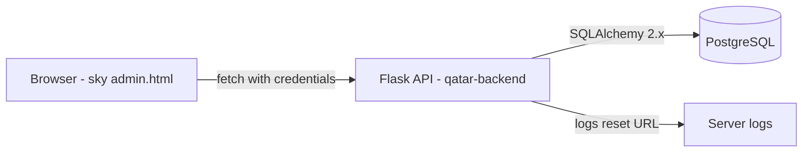
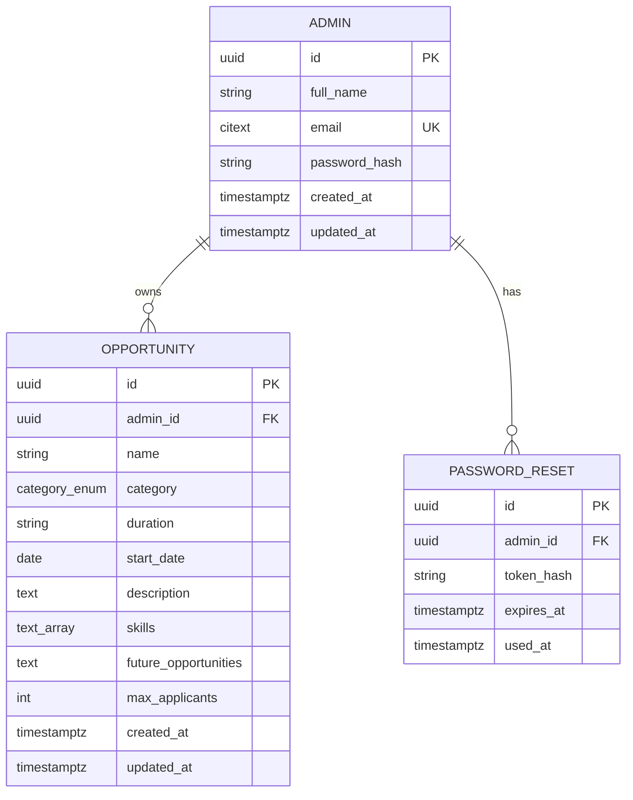
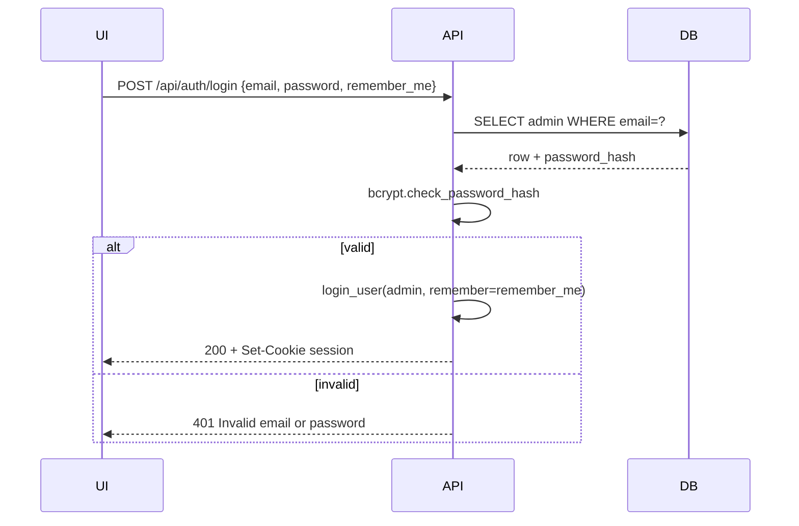
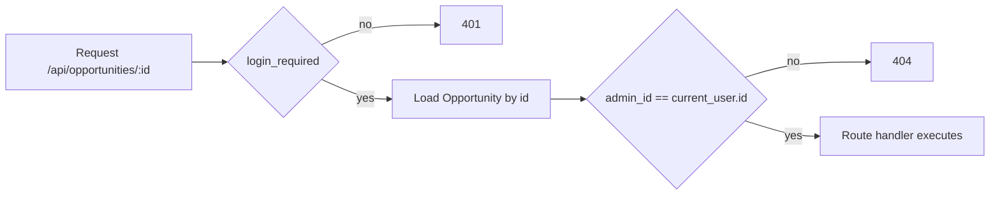

# Qatar Foundation Admin Portal — Design

## 1. Architecture Overview



- Single Flask process exposes `/api/*` and is consumed by the existing static UI in [`sky/`](sky/).
- Authentication is session-cookie based (Flask-Login) with CSRF tokens for state-changing requests.
- PostgreSQL is the only persistence layer. No in-memory or localStorage state on the server.

## 2. Tech Stack

| Concern    | Choice                                                      |
| ---------- | ----------------------------------------------------------- |
| Runtime    | Python 3.12                                                 |
| Framework  | Flask 3.x with app factory + Blueprints                     |
| Packaging  | uv with `pyproject.toml`; pip-compatible `requirements.txt` |
| ORM        | SQLAlchemy 2.x (typed ORM)                                  |
| Migrations | Flask-Migrate / Alembic                                     |
| Validation | Pydantic v2                                                 |
| Auth       | Flask-Login (server-side sessions)                          |
| Hashing    | Flask-Bcrypt                                                |
| CSRF       | Flask-WTF                                                   |
| CORS       | Flask-CORS (credentials enabled)                            |
| Config     | python-dotenv                                               |
| Tests      | pytest + pytest-flask                                       |
| Server     | gunicorn                                                    |

## 3. Project Layout

```
qatar-backend/
├── app/
│   ├── __init__.py        # create_app factory
│   ├── config.py          # Dev / Test / Prod
│   ├── extensions.py      # db, migrate, login_manager, bcrypt, csrf, cors
│   ├── models.py          # Admin, Opportunity, PasswordReset
│   ├── schemas.py         # Pydantic v2 schemas
│   ├── routes/
│   │   ├── __init__.py    # register_blueprints
│   │   ├── auth.py
│   │   └── opportunities.py
│   └── utils.py           # owner_required, error helpers
├── migrations/
├── tests/
│   ├── conftest.py
│   ├── test_auth.py
│   └── test_opportunities.py
├── .env.example
├── pyproject.toml
├── requirements.txt
├── run.py
└── README.md
```

## 4. Data Model



- `category_enum`: `Technology | Business | Design | Marketing | Data Science | Other`.
- `opportunities.admin_id` has `ON DELETE CASCADE`.
- `email` uses the `citext` extension for case-insensitive uniqueness.
- `skills` is a Postgres `TEXT[]` column.

## 5. API Surface

| Method | Path                        | Auth                   | Body Schema     | Response                          |
| ------ | --------------------------- | ---------------------- | --------------- | --------------------------------- |
| POST   | `/api/auth/signup`          | none                   | `SignupIn`      | 201 `AdminOut` / 409 / 422        |
| POST   | `/api/auth/login`           | none                   | `LoginIn`       | 200 `AdminOut` + Set-Cookie / 401 |
| POST   | `/api/auth/logout`          | session                | —               | 204                               |
| GET    | `/api/auth/me`              | session                | —               | 200 `AdminOut` + CSRF cookie      |
| POST   | `/api/auth/forgot-password` | none                   | `ForgotIn`      | 200 generic                       |
| POST   | `/api/auth/reset-password`  | none                   | `ResetIn`       | 200 / 400                         |
| GET    | `/api/opportunities`        | session                | —               | 200 `OpportunityOut[]`            |
| POST   | `/api/opportunities`        | session + CSRF         | `OpportunityIn` | 201 `OpportunityOut`              |
| GET    | `/api/opportunities/<id>`   | session + owner        | —               | 200 / 404                         |
| PUT    | `/api/opportunities/<id>`   | session + CSRF + owner | `OpportunityIn` | 200 / 404                         |
| DELETE | `/api/opportunities/<id>`   | session + CSRF + owner | —               | 204 / 404                         |

## 6. Auth Flow



## 7. Password Reset Flow

```mermaid
sequenceDiagram
    participant UI
    participant API
    participant DB
    UI->>API: POST /api/auth/forgot-password {email}
    API->>DB: lookup admin
    alt found
        API->>API: token = secrets.token_urlsafe(32)
        API->>DB: insert password_resets {hash, expires=+1h}
        API->>API: log reset URL
    end
    API-->>UI: 200 generic
    UI->>API: POST /api/auth/reset-password {token, new_password}
    API->>DB: SELECT WHERE hash=? AND used_at IS NULL AND expires_at>now
    alt valid
        API->>DB: update admin.password_hash; mark token used
        API-->>UI: 200
    else
        API-->>UI: 400 Reset link is invalid or has expired
    end
```

## 8. Opportunity Authorization



`@owner_required` returns 404 (not 403) when the row is not owned by the requester, to avoid leaking existence of opportunities across accounts.

## 9. Validation Strategy

- Each route binds JSON via `Schema.model_validate(request.get_json())`.
- Pydantic `ValidationError` → 422 handler in [`app/utils.py`](qatar-backend/app/utils.py) returns the standard error envelope.
- Pydantic schemas in [`app/schemas.py`](qatar-backend/app/schemas.py):
  - `SignupIn`: `full_name`, `email: EmailStr`, `password: SecretStr (min_length=8)`, `confirm_password`. Cross-field validator for match.
  - `LoginIn`: `email`, `password`, `remember_me: bool = False`.
  - `ForgotIn`: `email`.
  - `ResetIn`: `token`, `new_password (min_length=8)`.
  - `OpportunityIn`: required fields + optional `max_applicants`. `skills` accepts CSV string OR list, normalized to `list[str]` of trimmed non-empty values.
  - `OpportunityOut`, `AdminOut`: response models with `id`, timestamps, etc.

## 10. Configuration (env)

| Env Var                         | Purpose           | Example                                     |
| ------------------------------- | ----------------- | ------------------------------------------- |
| `FLASK_ENV`                     | dev / test / prod | `dev`                                       |
| `SECRET_KEY`                    | session signing   | random 64 chars                             |
| `DATABASE_URL`                  | Postgres DSN      | `postgresql+psycopg://user:pw@localhost/qf` |
| `FRONTEND_ORIGIN`               | CORS allowlist    | `http://localhost:5500`                     |
| `SESSION_COOKIE_SECURE`         | true in prod      | `true`                                      |
| `SESSION_COOKIE_SAMESITE`       | cookie SameSite   | `Lax`                                       |
| `REMEMBER_COOKIE_DURATION_DAYS` | remember-me TTL   | `30`                                        |
| `BCRYPT_LOG_ROUNDS`             | hash cost         | `12`                                        |
| `RESET_TOKEN_TTL_MIN`           | reset link expiry | `60`                                        |

## 11. Error Envelope

All errors return JSON:

```json
{
  "error": "validation_error",
  "message": "Invalid payload",
  "fields": { "email": "Invalid format" }
}
```

Codes: `validation_error` (422), `unauthorized` (401), `forbidden` (403), `not_found` (404), `conflict` (409), `bad_request` (400), `server_error` (500).

## 12. Frontend Wiring (no UI changes)

Only [`sky/admin.js`](sky/admin.js) is rewired:

- All requests use `fetch(url, { credentials: 'include' })`.
- POST / PUT / DELETE include header `X-CSRFToken` read from the `csrf_token` cookie issued by `GET /api/auth/me`.
- Hardcoded opportunity cards (Full Stack, Data Science, etc.) are removed; the list renders from `GET /api/opportunities`.
- Empty state is rendered when the API returns `[]`.

[`sky/admin.html`](sky/admin.html) and [`sky/admin.css`](sky/admin.css) are not modified.

## 13. Testing Strategy

- [`tests/conftest.py`](qatar-backend/tests/conftest.py) creates an app with a test config, an isolated DB (ephemeral Postgres or SQLite for fast unit tests where compatible), and fixtures: `client`, `admin_a`, `admin_b`, `auth_a`, `auth_b`.
- [`tests/test_auth.py`](qatar-backend/tests/test_auth.py): signup happy/dup/validation, login success/invalid/generic-message, remember-me cookie max-age, forgot-password constant 200, reset-token expiry and single-use.
- [`tests/test_opportunities.py`](qatar-backend/tests/test_opportunities.py): list scoping, ownership isolation 404s on GET/PUT/DELETE, CRUD round-trip, category enum rejection, empty state, CSRF rejection on POST/PUT/DELETE without token.
- Coverage target ≥ 80%.

## 14. Deployment

- Local: `flask run` via [`run.py`](qatar-backend/run.py) with `FLASK_DEBUG=1`.
- Prod: `gunicorn -w 4 -b 0.0.0.0:8000 run:app` behind a reverse proxy that terminates TLS.
- Migrations: `flask db upgrade` on deploy.
- Optional: minimal `Dockerfile` based on `python:3.12-slim` + `gunicorn`.
